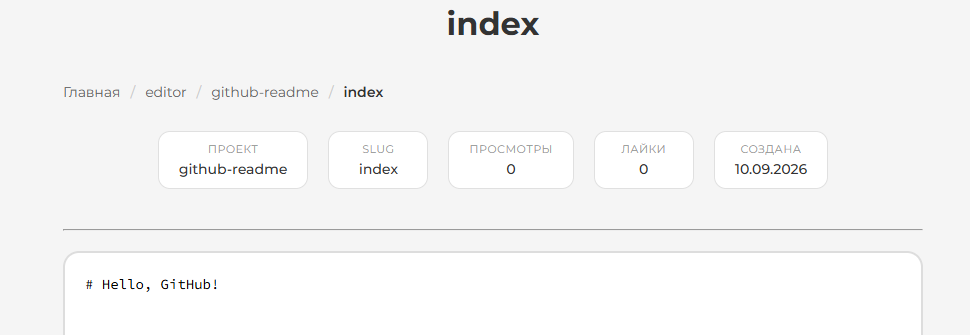
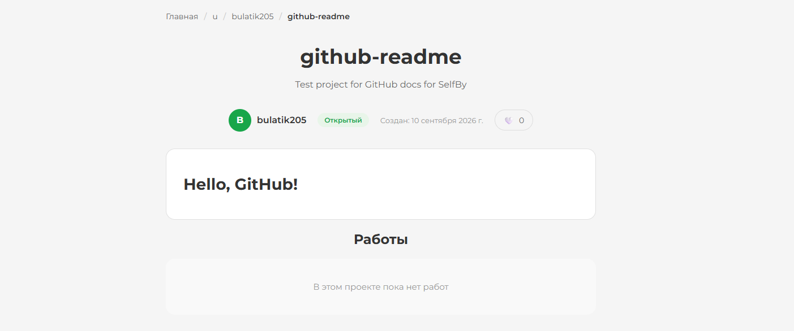
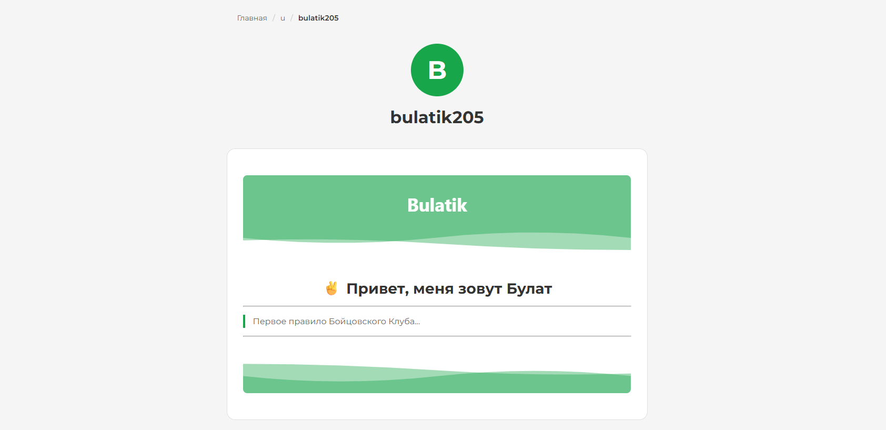

# SelfBy

SelfBy - веб приложение, в котором пользователи могут создавать проекты и работы. Каждая работа - это часть проекта, написанная в формате `md`.

[](LICENSE)
[]()

## Содержание
- [О проекте](#-о-проекте)
- [Возможности](#-возможности)
- [Возможности index](#-возможности-index)
- [Технологии](#-технологии)
- [Установка](#-установка)
- [Структура проекта](#-структура-проекта)
- [Контакты](#-контакты)

## О проекте

> _Этот проект не решает проблему глобального потепления. **В первую** очередь этот проект служит полигоном для моих первых знаний Go. **Во вторую** очередь этот проект решает проблему моего личного блога: он был написан на PHP, кривая архитектура, тормозил, а большая часть функций урезана._ Здесь же я получаю доступ ко всем привилегиям **Markdown**. Они рендерятся при сохранении в HTML и выводятся на страницу. Это проще и надежнее, чем собственный велосипед.

> _Код почти полностью написан нейросетью. Архитектура, логика, связи и все то, как должно работать - придумано мной._

В первую очередь хотел бы рассказать про словарь внутри проекта ведь он может ввести в заблуждение. 

| Термин | Определение |
|--------|-------------|
| **Работа** | Пост в `.md`, который при сохранении преобразуется в HTML и выводится как пост |
| **Проект** | Точка сбора всех работ (постов) |

## Возможности

- Создание аккаунта
- Создание проекта
- Создание работы  
- Поддержка `md` в работах
- Лайки и просмотры
- Хлебные крошки, подсказки, всплывающие меню

## Возможности index 

Это фишка, которая относится к проектам и пользователям. Каждый пользователь после создания проекта может создать работу с названием `index` (`/u/{username}/{projectName}/index`). 

---

<div align="center">



Пример работы `github-readme/index` 

</div>

Эта работа будет показываться на главной самого проекта. При этом сам проект `index` скрыт из общего списка работ:

<div align="center">



Страница `/u/bulatik205/github-readme` с `index` работой

</div>

---

Эта же функция работает для самого пользователя. Для этого необходимо создать проект и работу `/u/{username}/index/index`. Проект и работа также скрываются из профиля. Их не видно другим, как проект, но видно результат в профиле у пользователя.

<div align="center">



Страница `/u/bulatik205/` с `index/index` проектом/работой

</div>

> Важно: баг то, или фича (скорее баг, который я нашел, пока писал документацию), но нет смысла менять тип проекта на закрытый/открытый - информация о профиле покажется всё равно. Бригада [issue](https://github.com/bulatik205/selfby/issues/10) уже выехала  

## Технологии

В проекте используются:

- Go - серверная часть
- HTML/SCSS - страницы и стили
- JS - AJAX для SPA 
- Библиотеки:

| Библиотека | Назначение |
|------------|-----------|
| [go-sql-driver/mysql](https://github.com/go-sql-driver/mysql) | Драйвер MySQL |
| [golang.org/x/crypto](https://pkg.go.dev/golang.org/x/crypto) | Хеширование паролей |
| [filippo.io/edwards25519](https://filippo.io/edwards25519) | Криптография (зависимость crypto) |
| [yuin/goldmark](https://github.com/yuin/goldmark) | Markdown → HTML |

## Установка

### Требования
- Go 1.22+
- MySQL 8.0+

### Шаги

1. Клонировать репозиторий:

```bash
git clone https://github.com/bulatik205/selfby.git
cd selfby
```

2. Создать базу данных:

```
CREATE DATABASE selfby CHARACTER SET utf8mb4 COLLATE utf8mb4_unicode_ci;
```

3. Создать таблицы из файла [mysql/index.sql](mysql/index.sql)

4. Скопировать конфиг [config/example.config.go](config/example.config.go):

```
cp config/example.config.go config/config.go
```

5. Заполнить `config.go`:

```
DBUser:     getEnv("DB_USER", "root"),
DBPassword: getEnv("DB_PASSWORD", ""),
DBHost:     getEnv("DB_HOST", "localhost"),
DBPort:     getEnv("DB_PORT", "3306"),
DBName:     getEnv("DB_NAME", ""),
ServerPort: getEnv("SERVER_PORT", "8080"), 
```

6. Скачать зависимости и запустить:

```
go mod download
go run .
```

Приложение доступно на http://localhost:8080

## Структура проекта

```
├───config              конфигурация
├───handlers            обработчики серверной логики
│   ├───api             обработчики для api
│   └───auth            обработчики для login/reg
├───images              статика: фото
├───js                  статика: js
│   ├───auth            регистрация и вход
│   ├───dashboard       дашборд
│   ├───editor          страница редактора проектов
│   │   └───work        страница редактора работ
│   ├───index           главная страница
│   ├───profile         профиль
│   ├───projects        страница с проектами
│   ├───public-project  для публичных проектов
│   ├───public-work     для публичных работ
│   └───users           топ пользователи
├───mysql               исходный код таблиц
├───styles              статика: стили
│   ├───404             HTTP 404 
│   ├───auth            ...
│   ├───dashboard
│   ├───editor
│   │   └───work
│   ├───index
│   ├───profile
│   ├───projects
│   ├───public-project
│   ├───public-work
│   └───users           ...
├───templates           статика: html
├───videos              статика: видео
├───go.mod              зависимости модуля
├───go.sum              контрольные суммы зависимостей
└───main.go             точка входа
```

# Контакты

| Имя | Соцсеть | Ссылка | Комментарий |
| ----- | ----- | ----- | ----- |
| Bulatik205 | GitHub | [GitHub](https://github.com/bulatik205) |
| Bulatik205 | Website | [Website](https://bulatik.website) |
| Bulatik205 | Telegram | [Telegram](https://t.me/bulatik205) | Долгий ответ |
| SelfBy | Website | [Website](https://selfby.ru) | Готовый проект |
| SelfBy | GitHub | [GitHub](https://github.com/bulatik205/selfby) | Вы здесь |